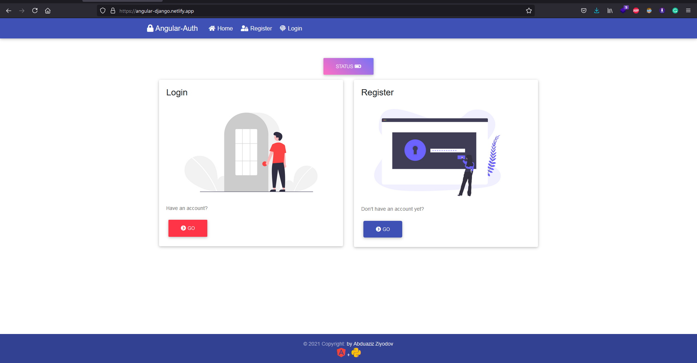

# Angular-Django-Authentication

> JWT authentication example Angular+Django with crud.



# Setup

Clone this repo:

```bash
$ git clone https://github.com/AbduazizZiyodov/angular-auth
$ cd angular-auth/
```

**Backend**

Create virtual enviroment for backend depences:

```bash
$ cd angular-auth-backend/
$ python3 -m venv env && source env/bin/activate
```

Install all required pip packages using `pip` command:

```bash
$ pip3 install -r requirements.txt
```

**Frontend**

Navigate to frontend directory:

```bash
$ cd angular-auth/
```

We have to launch the most powerful command in the world:

```bash
$ npm install 💥
```

# Backend

Create super user:

```bash
$ python3 manage.py createsuperuser
... #your password & username
```

Run development server:

```bash
$ python3 manage.py runserver
```

# Frontend

Run development server:

```bash
$ ng serve
```

Build:

```bash
$ ng build --prod
```

# API Reference

### Authentication 🔐

Login URI: `/api/auth/login`

Request data:

```json
{
    "username":string,
    "password":string
}
```

Request Method - **[POST]**

Response:

```json
{
  "access": "jwt_access_token",
  "refresh": "jwt_refresh_token"
}
```

<hr>
Register URI: `/api/auth/register`

Request data:

```json
{
    "username":string,
    "email":string,
    "password":string
}
```

Request Method - **[POST]**

Response:

```json
{
  "id":int,
  "email":string,
  "username":string,
  "password":string //password hash
}
```

Refresh token URI: `api/auth/refresh`

Request data:

```json
{
    "refresh":string //refresh token
}
```

Request method - **[POST]**

Response:

```json
{
    "access":string //fresh jwt token 😊
}
```

# CRUD ♻

### Get

Header:

- Authorization : "Bearer `jwt_token`"

Request URI: `api/people`
Request method - **[GET]**
Response:

```json
[
  {
    "id": int,
    "first_name": string,
    "last_name": string,
    "age": int,
    "created_at": string
  }
  ...
]
```

### POST

Header:

- Authorization : "Bearer `jwt_token`"

Request URI: `api/person/add`
Request method - **[POST]**
Request data:

```json

  {
    "first_name": string, //required
    "last_name": string, //required
    "age": int, //required
  }

```

Response:

```json
  {
    "id": int,
    "first_name": string,
    "last_name": string,
    "age": int,
    "created_at": string
  }
```

### PATCH

Header:

- Authorization : "Bearer `jwt_token`"

Request URI: `api/person/:id/update`

> Note: id:int

Request method - **[POST]**
Request data:

```json

  {
    "first_name": string,
    "last_name": string,
    "age": int
  }

```

Response:

```json
  {
    "id": int,
    "first_name": string,
    "last_name": string,
    "age": int,
    "created_at": string
  }
```

### DELETE

Header:

- Authorization : "Bearer `jwt_token`"

Request URI: `api/person/:id/delete`

> Note: id:int

Request method - **[DELETE]**
Request body - not required

Response:

```json
[] //empty response (with 204 code)
```

**Abduaziz Ziyodov**
